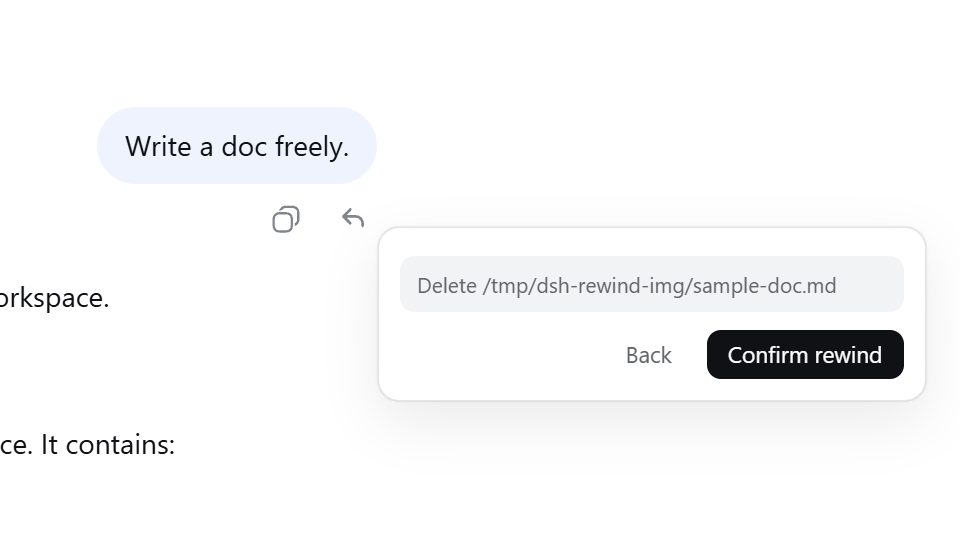
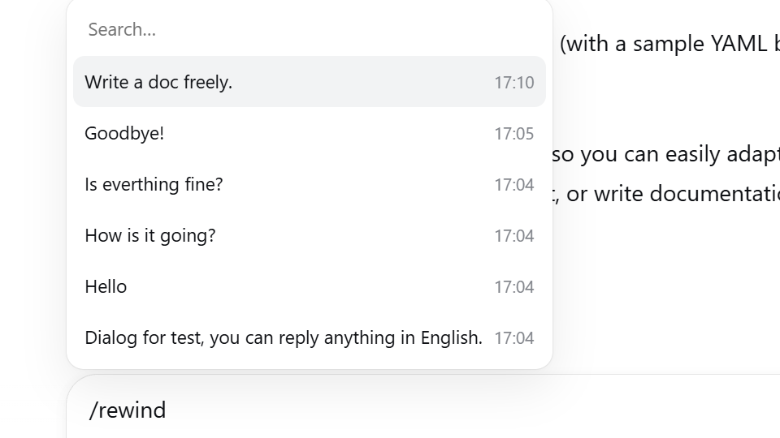
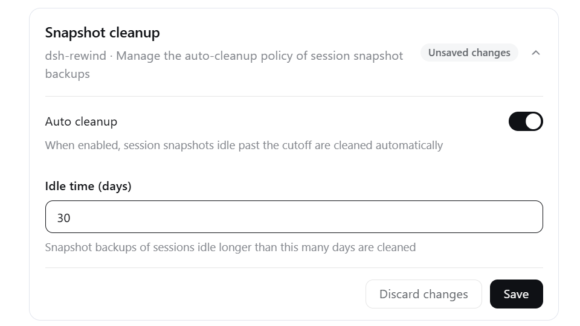

# dsh-rewind

> [!WARNING]
> **请尽早在 DSH `0.1.2-rc.1` 安装 `v0.9.x` 版本，运行 `/dsh-rewind-fix` 更新旧会话的回退标记**（[更新指南](docs/rewind-fix.zh.md)）。

DeepSeek Harness 插件：**一键就地回退对话到任意更早的用户消息**——同窗口内完成，不新建分支、不换窗口，可一并还原工作区文件（完整 Claude Code `/rewind` 语义）。

[](https://www.npmjs.com/package/dsh-rewind-plugin)
[](https://www.npmjs.com/package/dsh-rewind-plugin)
[](https://github.com/SiriLee/dsh-rewind/actions/workflows/ci.yml)

> [English](README.en.md) | 中文

刻意聚焦、保持极简，只做一件事：**就地回退到任意远的用户消息**，还能**顺手还原改过的文件**。

- **回退 = 时间回溯**——目标消息及其之后的全部内容（agent 回复、工具调用）同时从**模型上下文**和**渲染对话**中撤回，不新建会话、不切换窗口；目标消息文本会回填输入框，改完可重发。**在原理上就真正无感、便捷**。
- **轻量工作区备份**——对齐 Claude Code：追踪写类工具编辑过的文件，**已跟踪文件的外部变更也能还原**。局部追踪、写前备份、不变不存。一个轻型插件，即拥有**完备的智能体回退能力**。
- **信息安全优先**——插件从不删改会话日志（append-only），从不真正删除你的任何对话；备份存于自己的快照目录；还原只用这些备份。完整安全模型：[SECURITY.md](SECURITY.md)。
- **完备测试系统**——单元、探针、端到端主机验证，覆盖兼容性探测、日志重放、续接、跨重启等场景；随 harness 升级持续维护，确保功能稳定。

## 效果预览

每条用户消息的操作行都有一个 **↶ 回退** 按钮。点击后弹出模式选择浮层——「**仅回退对话**」或「**回退对话和代码**」，后者会先展示文件变更清单再确认。还可以通过 **`/rewind` 命令**和**快捷键**便捷地选择和回退。

<table>
  <tr>
    <td align="center"><br><sub>用户消息旁的 ↶ 回退按钮</sub></td>
    <td align="center"><br><sub>模式选择浮层</sub></td>
  </tr>
  <tr>
    <td align="center"><br><sub>「回退对话和代码」影响清单</sub></td>
    <td align="center"><br><sub>/rewind 候选面板</sub></td>
  </tr>
</table>

## 安装

确认本机 DSH 版本后，在 [Release](https://github.com/SiriLee/dsh-rewind/releases) 找到适配的插件版本。

```sh
dsh plugin --profile web add dsh-rewind-plugin@<版本>
```

> ⚠️ npm 上的 `dsh-rewind` 属于其他作者，请用 `dsh-rewind-plugin` 安装。

## 使用

1. 在对话中找到要回退的那条用户消息，或输入 `/rewind`（或其别名 `/undo`）打开候选列表选择。
2. **选中它。** 小浮层提供两种模式——「仅回退对话」或「回退对话和代码」。
3. 回退立即生效：对话回到目标消息当时的样子，目标消息的文本自动回填输入框——改完直接重发。

**键盘操作**：候选列表与模式浮层均支持 ↑↓ 移动、Enter 确认、Esc 取消/返回。

<details>
<summary><b>边界说明</b></summary>

- 回退可以反复进行——没有阶段或次数限制。
- 回退本身**无法撤销**，但被撤回的内容仍保留在会话日志中。
- **插话也能回退**——模型尚未读取的 `steering` 插话消息，同样可作为回退目标，不会打断当前生成。
- **回退已读消息会打断当前正在运行的回合**——确保回退的安全执行。

</details>

## 存储管理

快照（写前备份）存储于 `<dsh home>/rewind-snapshots/`（默认 `~/.dsh/rewind-snapshots/`）。插件对**同一会话**的快照做内容去重并保留最近 100 组锚点；**手动删除该目录**仅清除文件备份（对话回退不受影响），插件会自动重建。

另提供**全局自动清理**（默认关闭）：把长期不活跃的会话快照整目录移除，不影响活动会话与对话日志。可在 `设置→插件→插件配置→快照清理` 面板查看与配置（自动清理开关、失活天数），也可用 `/snapshot-auto-cleanup` 命令查看、设置和运行。详见：[快照自动清理](docs/snapshot-auto-cleanup.zh.md)。



## 卸载

```sh
# 卸载插件
dsh plugin --profile web remove dsh-rewind-plugin

# 如需同时删除本地数据
rm -rf <dsh home>/rewind-snapshots
rm <dsh home>/snapshot-cleanup-last-sweep.json
```

插件的自动清理设置保存在设置文档（`<dsh home>/settings.yaml`）中。如需彻底清理，可手动删除对应键。

## 本插件的优势

和常见的几种做法相比，本插件在"回退"这件事上的取舍：

| 维度 | 常见做法 | 本插件 |
| --- | --- | --- |
| 对话回退 | Fork 分支新建对话 | **就地回退**——不新建会话、不切窗口，便捷回退 |
| 文件还原 | 无还原功能 / git 管理或完整快照 | **写前轻量备份**——写文件前自动存原内容，一键还原 |
| 依赖 | 常依赖 Git 仓库或完整快照引擎 | **无依赖**——不依赖 git，普通目录即可用 |
| 存储开销 | 整树快照占空间大 | **轻量**——不变不存，且只追踪写类工具改动过的文件 |

## 原理

整套设计只有两条主线，核心哲学朴素却克制：**对话部分「只遮蔽、不删除」**，使用 DSH 原生的「隐藏 + 替换」机制；**文件部分「局部追踪，写前轻量备份」**，参考 Claude Code 的检查点语义。

### 1. 对话回退：一次「遮蔽」，而不是「删除」

`append-only` 是铁律：会话日志只追加、从不改写——这是可审计与信息安全的地基。回退从不动历史，它只做一步：往日志末尾追加一条 **“空消息”标记**，把目标消息之后的全部内容「遮蔽 + 替换」掉，让模型和界面都只看得到目标之前的部分。

- **同一份日志**——只在当前会话的日志做简单追加，不新建会话、不新建分支，因此不会留下残留和副本；
- **标记是规范的**——采用与官方 `/compact` 相同的「隐藏 + 替换」：`/compact` 把一段历史压缩成摘要，`/rewind` 则换成一条“空消息”标记。由于其规范性，DSH 的日志重放、压缩、续接检查都能正确识别它，绝不会把它误认为真实对话；
- **替换内容无感**——模型对标记忽略、无感（实测验证）。配合插件对界面显示的处理，模型和你看到的对话就是目标消息当时的样子；
- **记录完整保留**——因为是「遮蔽」而非「删除」，被撤回的内容完整留在日志里，可审计、可追溯，原则上也能手动恢复。

> **设计点睛**：整个对话回退就是**一条**追加。它确定、可审计，且因为日志从未被破坏，回溯是「干净的」——用最小的动作，实现最完整的语义。那些与 DSH 内部的兼容细节（对 `/compact` 的复刻、空消息的遮蔽）正是插件的专业所在。

### 2. 文件还原：轻量检查点，「写前备份」

文件部分对齐 Claude Code 的检查点语义——**局部追踪、写前备份 + 每条消息重扫已跟踪文件**，而不是整树快照。这项取舍既省空间，又更完整：

- **写前备份**：只追踪写类工具（`write`、`edit`），写前**备份原内容**，并**记录、追踪**被处理的文件——从不备份整个工作区，因此轻量。
- **外部变更也追**：每条用户消息边界，插件重新检查所有已跟踪文件——命令执行、手动修改等外部变更同样被记录，回退时一并还原。这让「轻量」却不「残缺」。
- **不变不存**：记录只在有变化时发生——消息边界重扫时无变更的**不备份**（不留记录）；写前备份时若与前一条记录一致，只存指向它的链接（`ref`）而非复制内容。
- **还原准确**：以备份为唯一标准，对照真实磁盘，只动真正不一致的文件——被改过的还原、被新建的删除、被删除的恢复；备份逐字节存储。还原结果与备份一致，无“幽灵影响”。
- **安全与完整性**：路径经安全化处理，绝不越出备份根目录；符号/硬链接跳过，避免透过一次还原误伤同名的另一份文件；单个文件失败绝不中止整轮还原；备份与还原日志均原子写落盘（跨重启仍在），断电或崩溃后的半还原可续做或回滚。

> **设计点睛**：这套检查点的「轻」，来自**只记录被工具动过、且确实变化的文件**——写前备份保证可还原，不变不存与存链接压掉重复；还原时再对照真实磁盘，只动不一致的文件。

## 明确不做的事

本插件刻意保持轻量、聚焦"对话回退"这一件事，以下场景**不属于它的职责**：

- **整树 / Git 级快照**——只跟踪写类工具编辑 + 已跟踪文件的外部改动，从未被工具碰过的文件不还原。需要工作树级的完整快照回退时，请交给更专业的快照工具（git）。
- **子代理的编辑**——不追踪，子代理会话内也不提供回退（同 Claude Code）：子代理运行在自己的会话里，其备份无法由父会话的回退还原，因此也不会为子会话保留备份。
- **fork / 分支回退**——DSH 已内置「在新对话中分支」，不重复造轮子。

## 兼容性

- Node.js `^22.19.0 || >=24.0.0`。
- 兼容性定义、验证方法与版本对齐详见 [docs/compat/audit.md](docs/compat/audit.md)；支持的 DSH 版本由 `package.json` 的 `peerDependencies` 声明。

> [!WARNING]
> 本项目与 DeepSeek Harness 均处于开发者预览阶段。可复现环境请 pin 精确版本，
> 并阅读上述行为说明。

## 客户端契约

需要获知哪些转录行被回退撤回的第三方 DOM 插件，应使用 `dsh-rewind-plugin/client` 导出的稳定、与本地化无关的纯函数，切勿解析 `outcome.text`。`data-dsh-rewind-hidden` 属性标记被撤回的行（仅观测性）。
详见：[docs/contract/client-contract.zh.md](docs/contract/client-contract.zh.md)。

## 已知问题

1. **导出的日志是完整内容**——回退只是把消息从模型上下文和视图中移除，`/export` 导出的会话日志包含**已撤回的消息**。本插件无法改动导出。
2. **轻量文件回退存在代价**——特定情况可能无法回退所有修改。行为与 Claude Code 一致。详见：[文件回退的追踪边界](docs/compat/tracking-boundary.zh.md)。
3. **导轨显示已回退轮次**——DSH `v0.1.2` 新增右侧导轨，为已撤回消息保留刻度，悬浮显示已撤回正文。仅显示差异，无功能影响。
4. **回退重显系统提示词**——DSH `v0.1.2` 回退重发消息时，与 `/compact` 一样重显“系统提示词”组件。仅显示差异，无功能影响。
5. **旧回退标记不再兼容**——DSH `v0.1.3` 拒绝旧版插件（≤ 0.8.0）的回退标记。新版本已解决，并提供会话更新功能。详见：[更新指南](docs/rewind-fix.zh.md)。

> [!NOTE]
> 本插件提供浏览器端诊断输出；详见 [浏览器诊断](docs/compat/diagnostics.zh.md)。

## 安全

本插件只向会话日志追加回退标记事件，从不删除或改写已记录的历史。工作区文件仅在「回退对话和代码」时被改写，备份存储于 `<dsh home>/rewind-snapshots/`；还原以备份为唯一来源。不触碰你的 git 仓库，无网络请求，不访问任何凭据。对**长期不活跃**的会话，另有默认关闭的全局自动清理可整目录移除其快照，不影响活动会话与对话日志。完整安全模型：[SECURITY.md](SECURITY.md)。

## 开发

```sh
npm install            # devDeps 来自 npm registry
npm run check          # 一键全检：typecheck + test + build + verify:host + pack --dry-run
npm run typecheck      # tsc 三面编译（host + client + client-test）
npm test               # vitest：全部单元与兼容性测试套件
npm run build          # esbuild：lib/index.js（host ESM）+ lib/client.js（loader 闭包）+ .d.ts
node scripts/verify-host.mjs   # 端到端验证构建产物
```

`prepare` 执行完整构建，所以 git 安装与 `npm pack` / `npm publish` 总会产出完整的 `lib/` 与 `LICENSE`。

维护者：模块地图与 harness 接口参考见 [docs/harness-reference.md](docs/harness-reference.md)

贡献指南：[CONTRIBUTING.md](CONTRIBUTING.md)

## 发布

通过 GitHub Actions Trusted Publishing（OIDC，无存储 `NPM_TOKEN`）发布：推送 `v<版本>` tag，CI 即带 Sigstore provenance 发布。

```sh
npm version patch && git push origin <branch> --tags
```

一次性 npm 侧配置与完整流程：见 [docs/release/release.zh.md](docs/release/release.zh.md)。

## 许可

[MIT](LICENSE)
